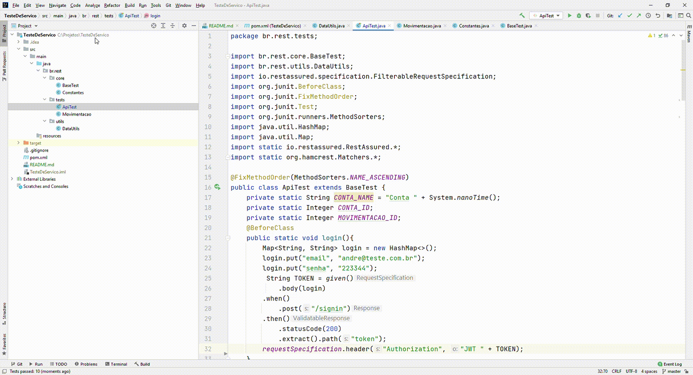
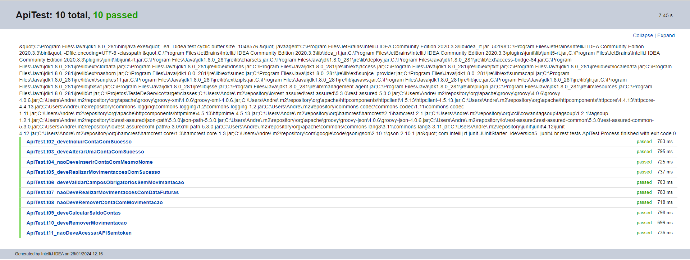

### Teste de API com restAssured

Projeto de automação de testes API rest.  
**Dependencias**
- RestAssured [versão](https://mvnrepository.com/artifact/io.rest-assured/rest-assured/5.3.0)
- Junit [versão](https://mvnrepository.com/artifact/junit/junit/4.12)

### Executado  
- Segue um exemplo dos testes sendo executados!

| 

### Resultado dos testes
- Anexo um print dos resultados dos teste.
|   
  
Obs: projeto criado separando as responsabilidades das classes, para facilitar o entedimento e futuras modificações no código.